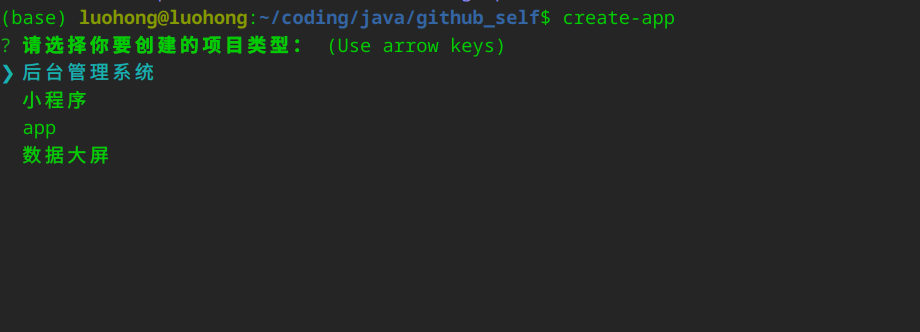

# 前端脚手架

## 环境介绍

node >= v16x   大于等于16版本

1. cd lhcli    进入到  lhcli 目录里
2. npm install   安装所需要的依赖 
3. npm link

执行完上述三步,脚手架在本地构建成功

## 使用脚手架 

进入到任意目录,执行 create-app

## 配置修改

进入到  config/index.ts 文件中

比如我们想修改或者新增

projectTypeList: 不同模板类型的添加 

projectTypeTemplateUrl： 对应模板的下载地址

